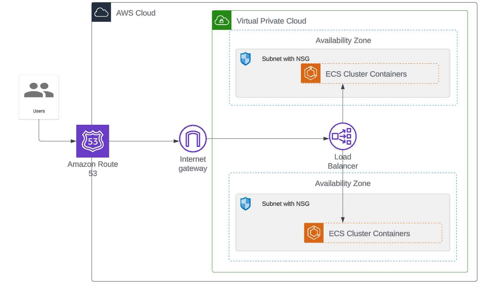

#  Welcome to the new containerized .NET app deployment through Amazon ECS

  
  
  
  

## Redis as a Cache Store
Redis (Remote Dictionary Server) is an in-memory data structure store that is known for its high-speed read and write capabilities, making it suitable as a database, cache, and message broker. It can handle large amounts of data, making it popular as a cache store. Redis can serve as a distributed cache, enabling multiple application instances to share cache data. It offers features like cache expiration and eviction policies to remove outdated or unused cache items automatically.  
- **Configuration took place in [appsettings.json](../awesome-compose/app/aspnetapp/appsettings.json) and [Startup.cs](../awesome-compose/app/aspnetapp/Startup.cs) files and the "StackExchange.Redis" package in [aspnetapp.csproj](../awesome-compose/app/aspnetapp/aspnetapp.csproj)**  

## Mongodb 
- Adding Nugget package MongoDB.Driver for connecting MongoDB database
- BSON serialization is used to convert MongoDB documents to C# object.

